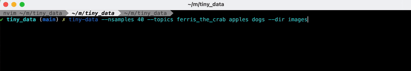

# tiny-data
A rust-based cli tool for building computer vision datasets built with [reqwest](https://docs.rs/reqwest/latest/reqwest/) and [tokio](https://tokio.rs/). 



You can get a list of the available options by running the command below:
```bash
>> tiny-data -h
Usage: tiny-data [OPTIONS]

Options:
  -t, --topics <TOPICS>...   Space-delimited list of image classes
  -n, --nsamples <NSAMPLES>  number of images to download per-class [default: 20]
  -d, --dir <DIR>            name of directory to save to [default: images]
  -h, --help                 Print help
```

Example:
```bash
>> tiny-data --nsamples 10  --topics ferris_the_crab apples dogs --dir demo
>> tree demo -L 1
demo
├── apples
├── dogs
└── ferris_the_crab
```


# Installation 
To get started with `tiny-data` you need to enable the [Custom Search API](https://developers.google.com/custom-search/v1/overview) from Google and export the variables `SEARCH_ENGINE_ID` and `CUSTOM_SEARCH_API_KEY` to your environment. 

**Note:**  google limits the number of requests to 100/day which inherently puts a cap on the number of images you can download. 

The package itself can be downloaded from [crates.io](https://crates.io/) by running 
```bash
cargo install tiny-data
```
